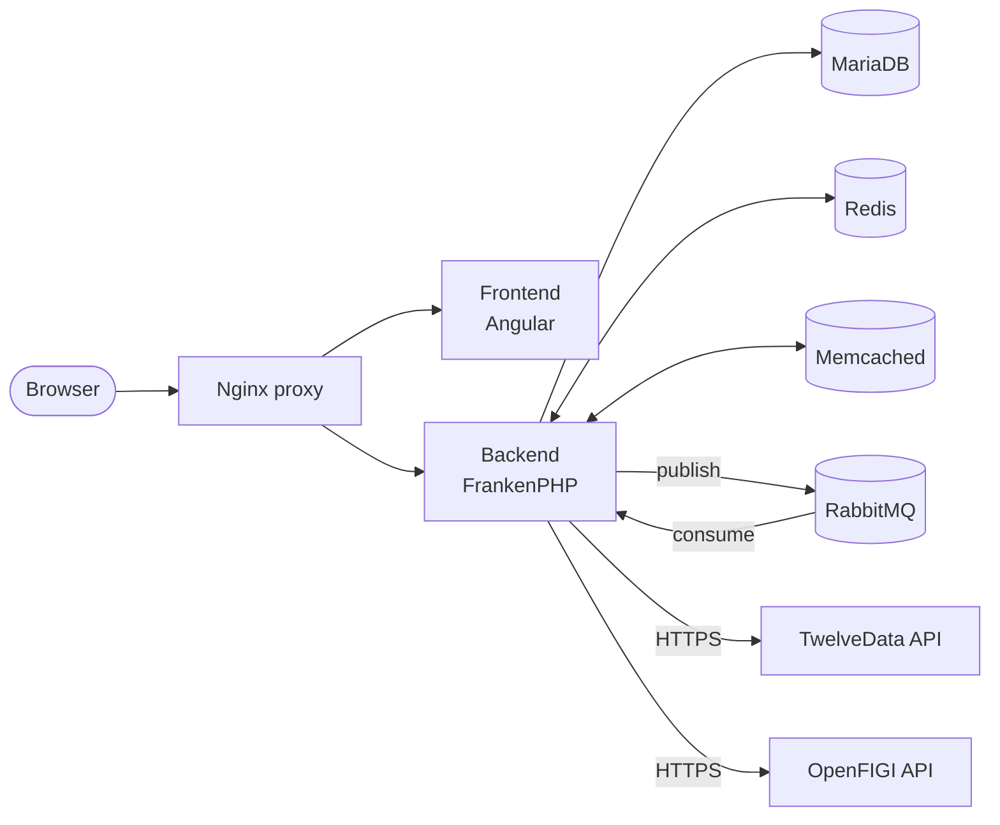

# FinGather — Your Ultimate Portfolio Tracker

<p align="center">
  
</p>

<p align="center">
  <strong>Take control of your financial future with comprehensive investment tracking</strong>
</p>

<p align="center">
  <a href="https://github.com/marekskopal/fingather/actions/workflows/backend.yml"></a>
  <a href="https://github.com/marekskopal/fingather/actions/workflows/frontend.yml"></a>
  <a href="https://github.com/marekskopal/fingather/actions/workflows/e2e.yml"></a>
  <a href="https://github.com/marekskopal/fingather/releases/latest"></a>
  <a href="LICENSE"></a>
</p>

<p align="center">
  <a href="https://www.fingather.com">Website</a> •
  <a href="#features">Features</a> •
  <a href="#installation">Installation</a> •
  <a href="#tech-stack">Tech Stack</a> •
  <a href="#contributing">Contributing</a>
</p>

Tracking all of your investments at once is challenging — most brokers lack the long-term analytical insights investors need. **FinGather** solves this by providing a unified portfolio tracking platform that gives you a detailed view of your entire investment landscape.

Whether you're managing stocks, cryptocurrencies, ETFs, bonds, or mutual funds, FinGather consolidates everything in one place with powerful analytics and beautiful visualizations.

This repository contains the source code for the FinGather community edition.

## Table of contents

- [Features](#features)
- [Tech stack](#tech-stack)
- [Architecture](#architecture)
- [Prerequisites](#prerequisites)
- [Installation](#installation)
- [Environment variables](#environment-variables)
- [Development setup](#development-setup)
- [Testing](#testing)
- [Continuous integration](#continuous-integration)
- [Project structure](#project-structure)
- [MCP server (AI integration)](#mcp-server-ai-integration)
- [Troubleshooting](#troubleshooting)
- [Contributing](#contributing)
- [License](#license)
- [Links](#links)

---

## Features

### Effortless Integration
Seamlessly connect with many broker, crypto, and investment platforms. Import your assets via CSV/Excel uploads or connect directly through supported APIs for real-time data access.

| Platform | CSV | Excel | API |
|---|:---:|:---:|:---:|
| Trading212 | ✅ | | ✅ |
| XTB | | ✅ | |
| Degiro | ✅ | | |
| eToro | | ✅ | ✅ |
| Portu | ✅ | | |
| Interactive Brokers | ✅ | | |
| Anycoin | ✅ | | |
| Binance | ✅ | | |
| Coinbase | ✅ | | |
| Revolut | ✅ | | |
| Fio Banka | ✅ | | |
| Patria Finance | | ✅ | |

### Advanced Analytics
Gain in-depth insights into:
- Portfolio performance and returns
- Dividend income tracking
- Fees and taxes overview
- Unrealized and realized gains/losses
- Currency risk assessment (FX Impact)

### Global Market Coverage
Access detailed reports, tables, and visualizations of assets from **80+ global exchanges** — all in one dashboard.

### Custom Asset Grouping
Categorize your investments the way you want:
- Create custom groups tailored to your strategy
- Use preset categories based on countries, asset types, or industry sectors
- Organize by any criteria that matters to you

### Benchmark Comparisons
Compare your portfolio performance against any benchmark you choose:
- S&P 500
- Bitcoin
- Any other asset in our database

Tailor your performance analysis to match your investment goals.

### Portfolio History
Track your portfolio value over time with interactive charts. See how your investments have grown and analyze performance across different time periods.

### Multi-Portfolio Support
Manage multiple portfolios with different currencies and strategies — all from a single account.

## Tech stack

| Component | Technology |
|-----------|------------|
| Backend | PHP 8.5+ with FrankenPHP |
| Frontend | Angular 21 (standalone components) |
| Database | MariaDB 11.4 |
| Caching | Memcached & Redis |
| Queue | RabbitMQ |
| Reverse proxy | Nginx |
| Container | Docker |

## Architecture

FinGather is a multi-service application orchestrated by Docker Compose. The reverse proxy fans requests out to the Angular frontend and the FrankenPHP backend; the backend talks to MariaDB for persistence, Redis and Memcached for caching, RabbitMQ for asynchronous work, and external APIs (TwelveData, OpenFIGI) for market data.



### Request flow

HTTP requests are routed by attribute-based controllers into services, which depend on repositories for persistence. Dependency injection is wired through League Container. Monetary values use `php-decimal` and are serialised as JSON **strings** on the wire — clients must parse them as such.

### Async jobs

Long-running work (price-alert checks, recalculations, scheduled fetches) is published to RabbitMQ and processed by an AMQP consumer. Throughput is tuned via `BACKEND_AMQP_CONSUMER_PREFETCH`.

### Caching

Two complementary layers sit at the service boundary: **Redis** for persistent caches that should survive restarts, **Memcached** for hot, ephemeral lookups.

## Prerequisites

FinGather uses [TwelveData](https://twelvedata.com) APIs to load stock and crypto data. You'll need an API key to run the application.

1. Register at [https://twelvedata.com/register](https://twelvedata.com/register)
2. Get your free API key

## Installation

### Quick start with Docker

1. **Clone the repository**
   ```bash
   git clone https://github.com/marekskopal/fingather.git
   cd fingather
   ```

2. **Configure environment**
   ```bash
   cp .env.example .env
   ```

   At minimum, set:
   - `TWELVEDATA_API_KEY` — your TwelveData API key
   - `AUTHORIZATION_TOKEN_KEY` and `ENCRYPTION_KEY` — random 32+ character strings
   - `PROXY_SSL_CERT` and `PROXY_SSL_KEY` — only if you want HTTPS

   See [Environment variables](#environment-variables) for the full reference.

3. **Build and run**
   ```bash
   docker compose up -d --build
   ```

4. **Access the application**

   Open [http://localhost](http://localhost) (or your configured domain) in your browser.

## Environment variables

All variables live in `.env` (copy from `.env.example`). Variables marked **required** must be set explicitly; everything else has a working default.

### Proxy / HTTPS

| Variable | Purpose |
|---|---|
| `PROXY_HOST` | Public hostname used by the proxy |
| `PROXY_PORT` | HTTP port (default `4100`) |
| `PROXY_PORT_SSL` | HTTPS port (default `4200`) |
| `PROXY_SSL_CERT` | Path to TLS certificate (optional) |
| `PROXY_SSL_KEY` | Path to TLS private key (optional) |

### Database (required)

| Variable | Purpose |
|---|---|
| `MYSQL_HOST` | Hostname of the MariaDB instance |
| `MYSQL_DATABASE` | Database name |
| `MYSQL_USER` / `MYSQL_PASSWORD` | Application credentials |
| `MYSQL_ROOT_PASSWORD` | Root password (used by the bundled `db` container) |

### Backend tuning

| Variable | Purpose |
|---|---|
| `BACKEND_FRANKENPHP_WORKERS` | Worker pool size (default `10`) |
| `BACKEND_AMQP_CONSUMER_PREFETCH` | RabbitMQ prefetch count |
| `BACKEND_CORS_ALLOWED_ORIGIN` / `_HEADERS` / `_METHODS` | CORS policy |
| `BACKEND_LOG_LEVEL` | `production` or `debug` |

### Queue & cache (required)

| Variable | Purpose |
|---|---|
| `RABBITMQ_HOST` / `_PORT` / `_USER` / `_PASSWORD` | RabbitMQ connection |
| `MEMCACHED_HOST` / `_PORT` | Memcached connection |
| `REDIS_HOST` / `_PORT` / `_PASSWORD` | Redis connection |

### Mail

| Variable | Purpose |
|---|---|
| `SMTP_HOST` / `_PORT` / `_USER` / `_PASSWORD` | Outbound mail server (defaults to `maildev` in dev) |
| `EMAIL_FROM` | `From:` header for outgoing mail |

### Security (required)

| Variable | Purpose |
|---|---|
| `AUTHORIZATION_TOKEN_KEY` | Signing key for auth tokens |
| `ENCRYPTION_KEY` | Symmetric key for encrypted columns |

### External APIs

| Variable | Purpose |
|---|---|
| `TWELVEDATA_API_KEY` | **Required.** Stock & crypto data |
| `TWELVEDATA_CALENDAR_MAX_API_CALLS_PER_MINUTE` | Rate-limit budget for the free tier (`8` by default) |
| `OPENFIGI_API_KEY` | Optional — instrument identification |
| `GOOGLE_CLIENT_ID` | Optional — Google Sign-In |

### Development tooling

| Variable | Purpose |
|---|---|
| `PROFILER_ENABLE` | `1` to enable Buggregator profiling |
| `PROFILER_ENDPOINT` | Buggregator endpoint URL |
| `ADMINER_USER` / `ADMINER_PASSWORD` | Adminer login (dev profile) |

## Development setup

### Dev profile services

```bash
docker compose --profile dev up -d
```

This adds:

- **Adminer** — database UI accessible through the proxy
- **Buggregator** — debug & profiler dashboard at `http://localhost:8000` (also receives mail at `1025` and dumps at `9912`/`9913`)

### Backend

The backend is PHP 8.5+ on FrankenPHP with PHPStan (max level) and PHPCS configured.

```bash
cd backend
composer install
vendor/bin/phpstan analyse        # static analysis
vendor/bin/phpcs                   # coding standard
vendor/bin/phpcbf                  # auto-fix style issues
vendor/bin/phpunit                 # unit tests
```

See [`backend/CLAUDE.md`](backend/CLAUDE.md) for deeper guidance on services, repositories, and the migration system.

### Frontend

The frontend is Angular 21 on Node 24 + pnpm 10.

```bash
cd frontend
pnpm install
pnpm start                 # dev server with SSL
pnpm run lint              # ESLint + Stylelint
pnpm run lint-fix          # auto-fix
pnpm run build-prod        # production build
```

See [`frontend/CLAUDE.md`](frontend/CLAUDE.md) for component patterns, signals, and i18n notes.

## Testing

The root `Makefile` orchestrates every test suite.

| Command | What it runs |
|---|---|
| `make test` | Full suite — unit (parallel) + e2e |
| `make test-unit` | Backend + frontend unit tests in parallel |
| `make test-backend` | PHPUnit only (no Docker required) |
| `make test-frontend` | Vitest only |
| `make test-e2e` | Boots the test stack, runs Playwright, tears it down |
| `make test-env-up` / `make test-env-down` | Manual control of the test stack |

Frameworks:

- **PHPUnit 13** with **PHPStan max level** for the backend
- **Vitest** for the frontend
- **Playwright** for end-to-end tests, run against an ephemeral `docker-compose.test.yml` stack

## Continuous integration

GitHub Actions runs three workflows under [`.github/workflows/`](.github/workflows/). All three cancel in-progress runs on the same ref to save minutes.

| Workflow | Triggers on | Steps |
|---|---|---|
| [`backend.yml`](.github/workflows/backend.yml) | `backend/**` changes | PHPStan · PHPCS · PHPUnit (inside FrankenPHP image) |
| [`frontend.yml`](.github/workflows/frontend.yml) | `frontend/**` changes | ESLint · Stylelint · Vitest · production build |
| [`e2e.yml`](.github/workflows/e2e.yml) | backend / frontend / `docker-compose.test.yml` changes | Playwright; uploads HTML report and logs as artifacts |

## Project structure

```
fingather/
├── backend/           # PHP backend application
│   ├── src/
│   │   ├── Controller/    # HTTP endpoints
│   │   ├── Dto/           # Data Transfer Objects
│   │   ├── Model/         # Entities & Repositories
│   │   └── Service/       # Business logic
│   └── migrations/        # Database migrations
├── frontend/          # Angular frontend application
│   ├── src/
│   │   ├── app/           # Application modules
│   │   └── i18n/          # Translations (EN, CS)
│   └── ...
├── proxy/             # Nginx reverse-proxy config
├── docker-compose.yml
└── docker-compose.test.yml
```

## MCP server (AI integration)

FinGather includes a built-in [Model Context Protocol](https://modelcontextprotocol.io/) server that lets AI assistants like Claude access your portfolio data.

### Setup

1. **Create an MCP API key** in the app at **Settings → MCP API Keys → Add MCP API key**. Use the copy button to copy the full key.

2. **Add the server to Claude Code**
   ```bash
   claude mcp add fingather \
     --transport http \
     --url https://your-fingather-domain/api/mcp \
     --header "Authorization: Bearer YOUR_MCP_API_KEY"
   ```

### Available tools

| Tool | Description |
|------|-------------|
| `list_portfolios` | List all portfolios |
| `get_portfolio_summary` | Portfolio value, returns, and performance metrics |
| `list_assets` | Open holdings with performance data |
| `get_asset_detail` | Detailed performance for a single holding |
| `list_transactions` | Transactions with filters (type, date, search) |
| `add_transaction` | Record a buy, sell, dividend, or fee |
| `get_tax_report` | Realized gains, dividends, fees for a given year |
| `list_strategies` | Allocation strategies with target percentages |
| `get_rebalancing` | Suggested trades to reach target allocations |
| `list_goals` | Financial goals with progress |
| `search_tickers` | Search stocks, ETFs, crypto by symbol or name |

## Troubleshooting

**Port conflict on `4100` or `4200`** — change `PROXY_PORT` / `PROXY_PORT_SSL` in `.env` and rebuild the proxy.

**Backend healthcheck failing** — the `backend` container probes `http://localhost/api/health`. If it stays unhealthy, check the `log/` directory and the `backend` container logs (`docker compose logs backend`). The most common cause is a missing `AUTHORIZATION_TOKEN_KEY` or `ENCRYPTION_KEY`.

**TwelveData rate-limit errors** — the free tier allows 8 calls per minute. Lower `TWELVEDATA_CALENDAR_MAX_API_CALLS_PER_MINUTE` or upgrade your plan.

**CORS errors in the browser** — confirm `BACKEND_CORS_ALLOWED_ORIGIN` matches the origin you're loading the frontend from. `*` works for local development.

**Playwright tests stuck or browser locked** — tear down and rebuild the test stack:
```bash
make test-env-down && make test-e2e
```

**Database not starting** — the bundled `db` container is gated behind the `dev` profile. In production, point `MYSQL_HOST` at an external MariaDB instance.

## Contributing

Contributions are welcome! Please open a pull request — CI will run the relevant backend, frontend, and e2e suites automatically. Make sure local checks pass first:

```bash
# Backend
cd backend && vendor/bin/phpstan analyse && vendor/bin/phpcs && vendor/bin/phpunit
# Frontend
cd frontend && pnpm run lint && pnpm run test
```

## License

Released under the [MIT License](LICENSE). © 2023 Marek Skopal.

## Links

- **Website**: [https://www.fingather.com](https://www.fingather.com)
- **Issues**: [GitHub Issues](https://github.com/marekskopal/fingather/issues)
- **Changelog**: [CHANGELOG.md](CHANGELOG.md)

---

<p align="center">
  Made with ❤️ for investors who want clarity in their portfolio
</p>
